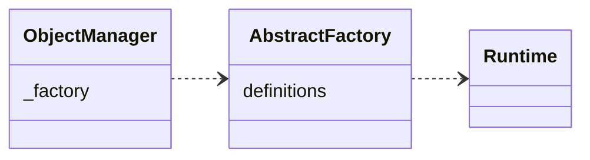

Magento的依赖注入容器（Object Manager）在生成某些特定类型的对象时，会自动生成这些类型的代码。常见的类型包括： `Factory` 、 `Proxy` 、`Interceptor` 等。代码生成的实现不在本文讨论范围内，这篇文章主要说明Magento是如何触发这个动作的。

事实上，代码生成的触发逻辑都在 `\Magento\Framework\Code\Generator` 的 `load` 方法里。
```php
public function load($className)
{
    if (! class_exists($className)) {
        try {
            $this->_generator->generateClass($className);
        } catch (\Exception $exception) {
            $this->tryToLogExceptionMessageIfNotDuplicate($exception);
        }
    }
}
```
可以看出，如果类型不存在就会尝试代码生成。这是一个 `autoload` 方法，在 `\Magento\Framework\ObjectManager\DefinitionFactory` 的 `createClassDefinition` 方法中进行了注册。
```php
public function createClassDefinition()
{
    $autoloader = new Autoloader($this->getCodeGenerator());
    spl_autoload_register([$autoloader, 'load']);
    return new Runtime();
}
```
在 `Magento\Framework\App\ObjectManagerFactory` 的 `create` 方法中做过 `createClassDefinition` 方法的调用。
`\Magento\Framework\ObjectManager\ObjectManager` 依赖 `FactoryInterface` ,而 `FactoryInterface` 依赖 `DefinitionInterface`。

以上。
