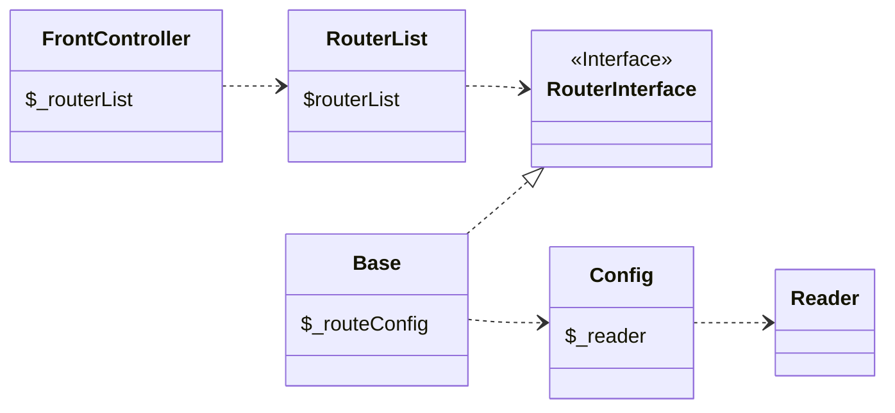

Magento处理一次 `http` 请求的大致过程如下：

1. 将请求交由 `index.php` 处理
2. 生成 `\Magento\Framework\App\Http` 实例，执行 `lauch` 方法
3. 生成 `\Magento\Framework\App\FrontController` 实例，执行 `match` 方法
4. `Front Controller` 实例化若干路由器
5. 这些路由器依次匹配请求的URL
6. 匹配到结果时，会得到 `\Magento\Framework\App\ActionInterface` 的实例
7. `ActionInterface` 执行 `execute` 方法
8. 上面的步骤得到 `\Magento\Framework\App\Response\HttpInterface`
9. 最后是 `Response` 的发送

应用的 `Front Controller` 经过路由器的匹配，把请求转发给匹配到的 `Action Controller` 。

```php
// \Magento\Framework\App\FrontController
$actionInstance = $router->match($request);
if ($actionInstance) {
    $result = $this->processRequest(
        $request,
        $actionInstance
    );
    break;
}
```

`Front Controller` 关联的 `RouterList` 包含了若干个路由器。比如 `standard` 路由器、`cms` 路由器、`default` 路由器等等。和绝大部分对象一样， `RouterList` 也是由 `ObjectManager` 生成的，因此相应的参数配置在相应模块的 `di.xml` 配置文件里。例如常用的 `standard` 路由器是由 `module-store` 配置的：
```xml
<!--/vendor/magento/module-store/etc/frontend/di.xml-->
<type name="Magento\Framework\App\RouterList" shared="true">
    <arguments>
        <argument name="routerList" xsi:type="array">
            <item name="standard" xsi:type="array">
                <item name="class" xsi:type="string">Magento\Framework\App\Router\Base</item>
                <item name="disable" xsi:type="boolean">false</item>
                <item name="sortOrder" xsi:type="string">30</item>
            </item>
            <item name="default" xsi:type="array">
                <item name="class" xsi:type="string">Magento\Framework\App\Router\DefaultRouter</item>
                <item name="disable" xsi:type="boolean">false</item>
                <item name="sortOrder" xsi:type="string">100</item>
            </item>
        </argument>
    </arguments>
</type>
```
配置文件重 `sortOrder` 越小，相较于其他路由器的权重越大，越优先匹配。

`standard` 路由器逻辑写在 `Magento\Framework\App\Router\Base` 里面，是使用较多的一种路由器。该路由器使用 `Magento\Framework\App\Route\Config` 来获取当前 `scope` 下的 `routes.xml` 所有关于路由的配置，然后进行匹配。（ `Config` 依赖 `\Magento\Framework\App\Route\Config\Reader` 读取 `xml` 配置文件。 ）
```php
// \Magento\Framework\App\Route\Config
public function getModulesByFrontName($frontName, $scope = null)
{
    $routes = $this->_getRoutes($scope);
    $modules = [];
    foreach ($routes as $routeData) {
        if ($routeData['frontName'] == $frontName && isset($routeData['modules'])) {
            $modules = $routeData['modules'];
            break;
        }
    }

    return array_unique($modules);
}
```


